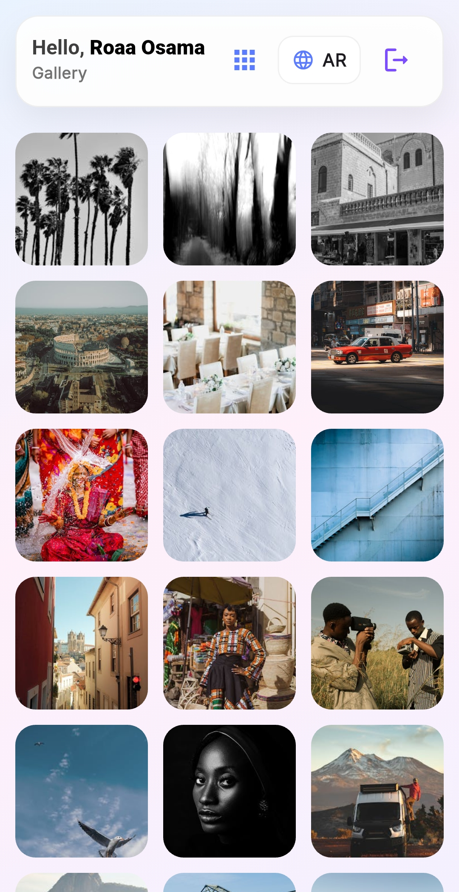
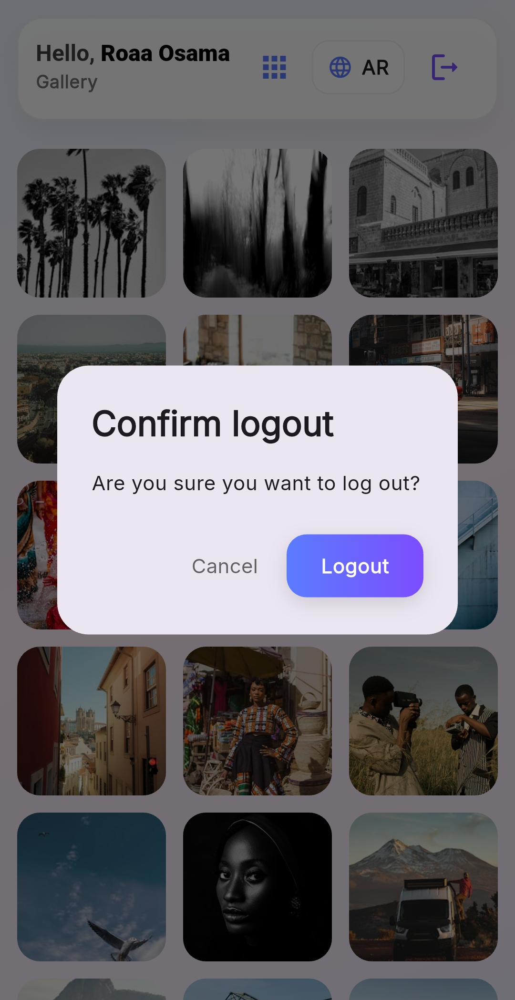
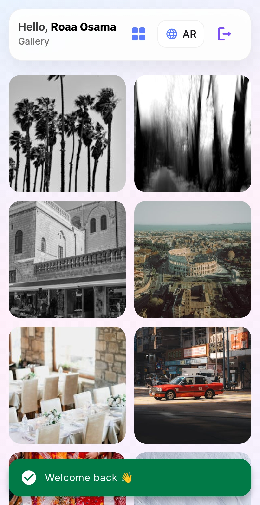

# New App: Flutter Secure Login & Image Gallery App

A Flutter mobile application demonstrating secure authentication and fetching paginated images from remote services using APIs, following clean and scalable architecture.

## 📱 Features

- 🔐 Secure Login using **Firebase Authentication**
- ☁️ Fetch user credentials from a **remote database**
- 🖼️ Fetch images from **Pexels API**
- ♻️ Pagination while scrolling
- 🧱 Feature-based architecture
- ⚠️ Proper error handling

---

## 🛠️ Tech Stack

- Flutter
- Firebase Authentication
- Firebase Firestore (remote backend)
- Pexels API
- flutter_dotenv
- Git & GitHub

---

## 🔑 Environment Variables

Sensitive keys are stored securely using environment variables.

Create a `.env` file:
* PEXELS_API_KEY=your_api_key_here
* PEXELS_BASE_URL=https://api.pexels.com/v1

.env is ignored and not committed to GitHub.

---

## 🔥 Firebase Setup
Firebase configuration files are not included in the repository.

To configure Firebase locally:
1. dart pub global activate flutterfire_cli
2. firebase login
3. flutterfire configure

-- This generates firebase_options.dart and platform-specific config files.

## ▶️ How to Run the App
1. git clone https://github.com/your-username/your-repo-name.git
2. cd your-repo-name
3. flutter pub get 
4. Add .env file 
5. Configure Firebase 
6. Run the app: flutter run

## 🔒 Security Notes
* Firebase Authentication handles password hashing and secure token management server-side.
* Minimal sensitive data is stored on the device.
* Authentication tokens are managed internally by Firebase SDK.

---
## 📸 Some Screenshots

